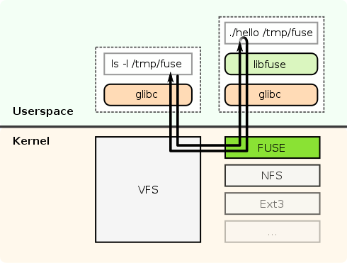

# TP3 - Réalisation d'un système de fichiers simple 01/10/25
> Note pour le TP3, que cela soit compréhension du document ou des notes pour  
> mieux comprendre certaine fonction.

## Objectif
Développement d'un module noyau capable de réaliser kes opérations de base d'un 
système de fichier simpliste (monter, lire un dossier, créer lire et écrire un
fichier).

## Principe
Syst fichier : futosfs ("Fuse Tiny OS FileSystem")
contienr 32 blocs de 4ko :
- 1 superblock
- 1 bloc d'inodes
- 1 bloc root 
- les 29 blocs restant en données

Size files = 1 bloc max

Infor superblock:
- Un nombre magique (pour identifier le système de fichiers)
- Une bitmpa des inodes
- La taille des blocs
- Le nombre de bloc (doit être 32)
- Le nombre d'inode root (doit être 1)

Struct inode simplifié:
- Le num inode
- le num du bloc où sont stockées les données
- diverse info (les droits, etc)

** Inode **
> Cela correspond à un répertoire, contient dans son bloc une suite de structure 
> dentrys collées les unes derrière les autres.

La structure dentry ici ne contriendra que deux champs :
- le numéro de l'inode associée au fichier
- le nom du fichier

## FileSystem in UserSpacE (FUSE)
Pour faciliter le développement de ce système de fichier, on va utiliser FUSE.

Ce comporte comme un pont entre l'espace utilisateur et le système fichier, pour 
développer les fonctionnalités du système de fichier directement depuis l'espace 
utilisateur, sans droit particulier.

### Exemple

Kerosen et Tesla sont des serveurs à distance de l'école.

``` 
<ins> Question </ins>

```
